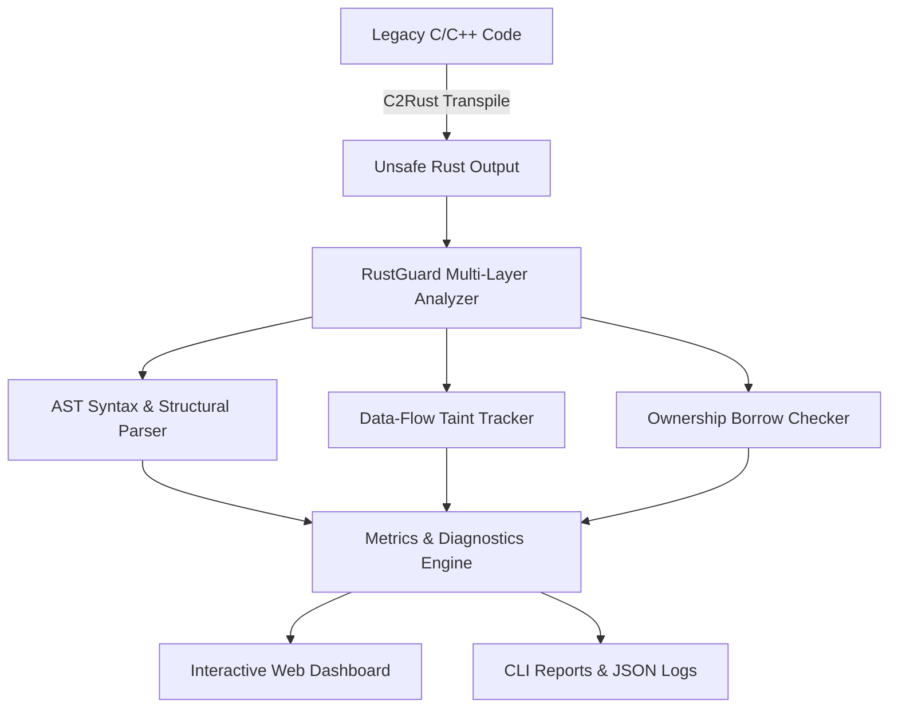

# 🦀 RustGuard Workspace (v0.3)

[](https://www.rust-lang.org/)
[](LICENSE)
[](https://github.com/wasifshaffaq/rustguard-workspace)
[](#)
[](#)

**RustGuard** is a Heuristic Semantic Analyser for C→Rust Transpilation, built upon the methodologies outlined in *Wu et al. (2025) | IEEE TrustCom*. 

It provides a multi-layered static analysis engine to evaluate the safety, soundness, and semantics of Rust code transpiled from C/C++, specifically targeting raw pointer hazards, unsafe memory layouts, logic flows, and LLM-induced translation hallucinations.

---

## 🎨 Visual Workspace Dashboard

RustGuard includes a premium, fully interactive web dashboard styled with a modern **Shadcn UI Zinc/Blue theme** and standard **Inter typography**.


### ✨ Core Interface Features
*   **Side-by-Side Monaco Editors** 💻: Full IDE syntax highlighting, multi-cursor editing, and keyboard mappings for original C code and transpiled Rust.
*   **Interactive AST & Ownership Graph** 📊: A 2D Canvas Physics simulation that parses Rust structs, functions, and unsafe scopes into draggable physics nodes with real-time neon-green taint flow particles.
*   **Diagnostic Curve Connectors** 🔀: Clicking an issue details card draws a glowing bezier curve connecting the card to the exact coordinate inside the Monaco editor.
*   **Dual-Stage Keystroke Evaluator** ⚡: Run instantaneous regex-based safety checks on every keystroke, with a debounced (300ms delay) backend compiler validation loop.
*   **Dark/Light Mode Switch** 🌗: Smooth transitions with a premium, animated toggle switch.

---

## ⚙️ How it Works: Architecture & Pipeline

Here is how RustGuard processes and analyzes your code:

### 🔄 System Architecture Flow


### 🛡️ The 7-Layer Verification Pipeline

```mermaid
flowchart LR
    L1["🔍 Layer 1<br/>Regex & CVE"] --> L2["📦 Layer 2<br/>AST Structure"]
    L2 --> L3["⚡ Layer 3<br/>Data-Flow Taint"]
    L3 --> L4["🔑 Layer 4<br/>Ownership Graph"]
    L4 --> L5["🔗 Layer 5<br/>Alias & Union"]
    L5 --> L6["📢 Layer 6<br/>Cross-Function"]
    L6 --> L7["🛠️ Layer 7<br/>Cargo Check"]

    style L1 fill:#090a10,stroke:#3b82f6,stroke-width:2px,color:#f3f4f6
    style L2 fill:#090a10,stroke:#3b82f6,stroke-width:2px,color:#f3f4f6
    style L3 fill:#090a10,stroke:#3b82f6,stroke-width:2px,color:#f3f4f6
    style L4 fill:#090a10,stroke:#3b82f6,stroke-width:2px,color:#f3f4f6
    style L5 fill:#090a10,stroke:#3b82f6,stroke-width:2px,color:#f3f4f6
    style L6 fill:#090a10,stroke:#3b82f6,stroke-width:2px,color:#f3f4f6
    style L7 fill:#090a10,stroke:#3b82f6,stroke-width:2px,color:#f3f4f6
```


---

## 📊 Standard Metrics

At the end of an analysis run, RustGuard generates standard quality metrics:

*   **SSS (Semantic Safety Score)**: Evaluates the ratio of semantically safe functions to total functions.
*   **UEI (Unsafe Exposure Index)**: Indicates the percentage of unsafe structural patterns in the codebase.
*   **VRR (Vulnerability Retention Rate)**: Measures how many C/C++ vulnerabilities survived the transpilation process.

---

## 💻 CLI Usage

Run analysis directly on a single Rust file or an entire Cargo project directory.

```bash
# Basic analysis of a Rust file
cargo run --release -- --rust path/to/file.rs

# Analysis of a Cargo project with original C source for CVE retention checking
cargo run --release -- --cpp path/to/original.c --rust path/to/cargo_project

# Skip cargo check for faster syntax-only analysis
cargo run --release -- --rust path/to/file.rs --no-cargo-check
```

---

## 🔰 The Ultimate Noob Guide: How to Setup & Run

Follow these simple steps to set up RustGuard on your computer and run it.

### Step 1: Install Prerequisites
Before running RustGuard, you need to install a few free tools on your computer:
1.  **Rust**: Go to [rustup.rs](https://rustup.rs/) and follow the instructions for your Operating System. This installs the Rust compiler.
2.  **Git**: Download and install Git from [git-scm.com](https://git-scm.com/) so you can clone repositories.
3.  **Python (Optional)**: Download and install Python from [python.org](https://www.python.org/) if you want to run the automated test suite. Make sure to check **"Add Python to PATH"** during installation.

### Step 2: Clone the Project
Open your terminal (PowerShell, Command Prompt, or Terminal on macOS/Linux) and run:
```bash
git clone https://github.com/wasifshaffaq/rustguard-workspace.git
cd rustguard-workspace
```

### Step 3: Build the Project
Compile the static analysis engine by running:
```bash
cargo build --release
```
*Note: The first build might take a few minutes as it compiles dependencies. Once complete, your binary is located in `target/release/`.*

### Step 4: Run the Web Server & Dashboard
To start the interactive web application, run:

*   **On Windows (PowerShell/CMD)**:
    ```powershell
    # Copy the compiled program to your root directory
    Copy-Item target\release\cpp2rust-debugger.exe .
    
    # Run the server
    .\cpp2rust-debugger.exe --server
    ```
*   **On macOS / Linux**:
    ```bash
    # Copy the compiled program to your root directory
    cp target/release/cpp2rust-debugger .
    
    # Run the server
    ./cpp2rust-debugger --server
    ```

Once you see the message `🦀 RustGuard v0.3 web server running on http://0.0.0.0:8080`, open your web browser and go to:
👉 **[http://localhost:8080](http://localhost:8080)**

---

## 🧪 Running the Comprehensive Test Suite

We have provided an automated test script that runs your analyzer against **19 real-world test cases** (covering clean code, raw pointers, unsafe block density, memory leaks, LLM hallucinations, and syntax errors).

To execute the test suite:
1. Make sure you compiled the project using `cargo build --release`.
2. Open your terminal in the project root and run:
   ```bash
   python run_tests.py
   ```
3. This will automatically execute all 19 tests, generate a detailed markdown report inside `test_report.md`, and compile an interactive web dashboard in `dashboard.html` for you to review.